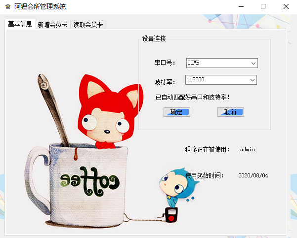
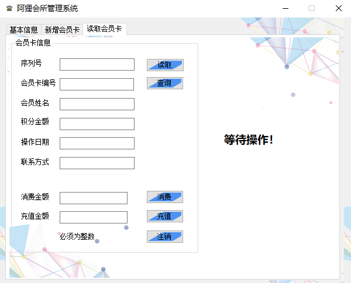
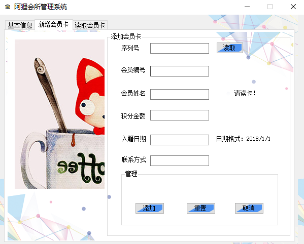

# Membership-Card-Management-System

This is an **RFID course project written in C#**, to practice related operations through the RFID identification device connected to the COM port.

本项目是 **基于 C# 的 RFID 课程 project**，通过和 COM 口连接的 RFID 射频识别设备完成相关操作。

- Project proposal 项目目的
    - Build a club membership card management system 实现一个会所的会员卡管理系统
    - Admin login 管理员登录
    - Connect to RFID card reader using COM port, automatically match baud rate 连接 COM 口 RFID 读卡设备，支持波特率自动匹配
    - Write new account data into membership card and local database 支持将新账户数据写入会员卡及本地数据库
    - Read user membership card information. Synchronize card consumption and recharge operations in local database. 支持读取用户会员卡信息，并实现消费、充值，同步本地数据库

- Project preview 项目预览
    - Login 管理员登录
        
        
    - Basic Info (connect to RFID indentification device) 基本信息（连接RFID读卡器）

        
    - Add new membership card 新增会员卡

        
    - Read membership card, consume and recharge 读取会员卡，消费及充值

        

- Language: Based on Visual Studio 2017 C# 使用 Visual Studio C#
- UI Design: C# form
- Database: Access MDB
